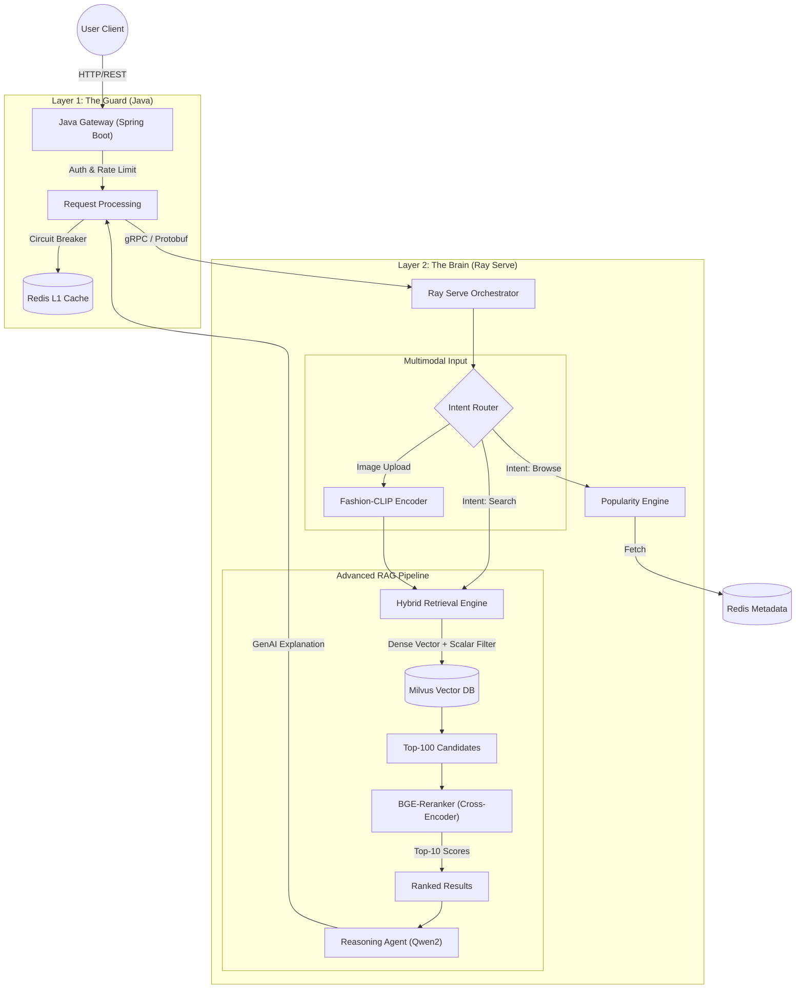

# ScaleStyle: Intelligent Multimodal Fashion Agent Platform

[](https://github.com/EthanGaoZhiyuan/ScaleStyle)
[](https://github.com/EthanGaoZhiyuan/ScaleStyle)
[]()
[]()
[](LICENSE)

## 📖 Executive Summary

**ScaleStyle** is an enterprise-grade **Intelligent Fashion Agent Platform** designed to bridge the gap between high-concurrency backend engineering and next-generation AI reasoning.

Unlike traditional recommendation systems that rely solely on collaborative filtering or simple vector similarity, ScaleStyle implements a **"Guard & Brain" Microservices Architecture**:

1.  **The Guard (Java/Spring Boot)**: A robust entry point handling high-concurrency I/O, rate limiting (Resilience4j), authentication, and circuit breaking.
2.  **The Brain (Ray Serve)**: An intelligent orchestrator managing a complex AI DAG (Directed Acyclic Graph), including **Intent Understanding**, **Hybrid Retrieval**, **Precision Reranking**, and **LLM-based Reasoning**.

This project benchmarks against L4/Senior-level industry standards (e.g., Google, Canva), addressing hard problems like **semantic drift**, **cold-start**, and **recommendation explainability**.

---

## 🏗️ System Architecture

ScaleStyle moves beyond simple CRUD to a **Multi-Stage Inference Pipeline**.



### 🧠 Core Architectural Decisions

* **Java for I/O, Python for AI**: Leverages Spring Boot 3.4 for robust API Gateway features while using Ray Serve for flexible Python ML orchestration.
* **SOTA Embeddings**: Migrated from BERT to **Alibaba Qwen2-7B** (3584 dim) for superior semantic understanding of product descriptions.
* **Two-Stage Retrieval (Recall + Rerank)**: Solves the "accuracy vs. speed" trade-off by using Milvus for fast recall (Top-100) and a **Cross-Encoder (BGE-Reranker)** for precise reranking (Top-10).
* **Hybrid Search Strategy**: Combines **Dense Vector Search** with **Scalar Filtering** (e.g., `price < 50`) to eliminate hallucinated results that don't match business constraints.
* **Agentic Reasoning**: Instead of just returning a list of items, the system generates a **"Why this item?"** natural language explanation, improving user trust.

---

## 🛠️ Technology Stack

| Layer | Technologies | Role in Architecture |
| :--- | :--- | :--- |
| **Gateway** | **Java 21, Spring Boot 3.4** | API Entry, Rate Limiting (Resilience4j), gRPC Client. |
| **Orchestration** | **Ray Serve** | Managing complex ML DAGs, A/B Testing, Scaling Workers. |
| **LLM & Vectors** | **Qwen2-7B, BGE-Reranker** | Semantic Embedding, Intent Classification, Reasoning. |
| **Multimodal** | **Fashion-CLIP** | Image-to-Item and Text-to-Image search. |
| **Data Store** | **Milvus 2.3** | High-performance Vector Database (IVF_FLAT Index). |
| **Cache** | **Redis 5** | Metadata storage, Hot-item caching, Session management. |
| **Protocol** | **gRPC (Protobuf)** | Low-latency communication between Java and Ray. |
| **Ops** | **Kubernetes (EKS), Terraform** | Cloud-native deployment, HPA (Auto-scaling). |
| **Observability** | **Jaeger, Prometheus** | Distributed Tracing and Metrics monitoring. |

---

## 📅 Roadmap & Progress

The project follows a strict Agile roadmap simulating a real-world R&D cycle.

### ✅ Phase 1: Foundation & Data Engineering (Completed)
* **Data Pipeline**: Processed 100k+ articles and 1M+ transactions (H&M Dataset).
* **SOTA Embedding**: Generated 3584-dim vectors using **Qwen2-7B-Instruct** on A100 GPU.
* **Ingestion**: Successfully batch-loaded vectors into **Milvus** and metadata into **Redis**.
* **Infrastructure**: Docker Compose setup for Milvus, Redis, and MinIO.

### 🚧 Phase 2: The "Brain" - Retrieval & Reranking (Current Focus)
* **Goal**: Upgrade from simple vector search to an intelligent retrieval engine.
* **Key Tasks**:
    * [ ] Implement **Ray Serve Router** for Intent Classification (Search vs. Sort vs. Browse).
    * [ ] Deploy **Hybrid Retrieval** logic (Milvus Scalar Filtering + Vector Search).
    * [ ] Integrate **BGE-Reranker** to re-score Top-100 candidates for precision.
    * [ ] **A/B Testing**: Traffic splitting between Smart Search (Model A) and Popularity Baseline (Model B).

### 🔮 Phase 3: The "Agent" - Multimodal & Production (Upcoming)
* **Goal**: Enable visual search and cloud-native reliability.
* **Key Tasks**:
    * [ ] **Fashion-CLIP** integration for "Search by Image".
    * [ ] **LLM Generation** (Qwen2) for recommendation explainability.
    * [ ] **Kubernetes (EKS)** deployment with Horizontal Pod Autoscaling (HPA).
    * [ ] Full Observability with **Jaeger** (Tracing) and **Prometheus** (Metrics).

---

## ⚡ Performance Targets

| Metric | Target | Context |
| :--- | :--- | :--- |
| **End-to-End Latency** | **< 100ms** | Including Java Gateway + Ray Inference + DB Roundtrip. |
| **Reranking Latency** | < 40ms | For batch scoring Top-100 candidates on GPU. |
| **Throughput** | 500+ QPS | Per Ray Replica (Scalable via K8s). |
| **Recall@10** | > 0.85 | Validated via offline evaluation set. |

---

## 🚀 Quick Start (Local)

**Prerequisites**: Docker, Python 3.10+, Java 21.

1.  **Start Infrastructure**:
    ```bash
    docker-compose up -d milvus redis minio
    ```

2.  **Start Ray Brain**:
    ```bash
    cd ray_serve
    pip install -r requirements.txt
    serve run config.yaml
    ```

3.  **Start Java Gateway**:
    ```bash
    cd java_gateway
    ./mvnw spring-boot:run
    ```

---

## 👤 Author

**Ethan Gao**
*Full-Stack ML Systems Engineer*

Specializing in bridging the gap between robust Backend Engineering (Java) and modern AI Infrastructure (Python).

---

## 📝 License

This project is open-sourced under the [MIT License](LICENSE).