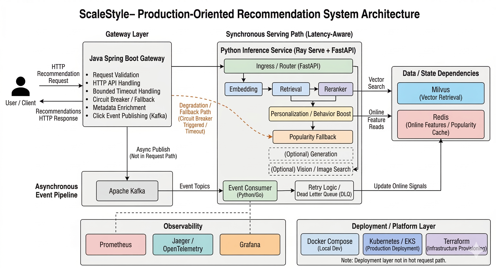

# ScaleStyle

**A real-time, personalized fashion recommendation engine built on Kafka, Ray Serve, and Milvus.**

---

## Project Overview

ScaleStyle is a cloud-native recommendation system for a fashion e-commerce context. The core engineering challenge it addresses is serving semantically relevant, behavior-aware recommendations under strict per-request latency budgets while continuously incorporating recent user signals from an asynchronous event pipeline — without coupling event processing to the synchronous serving path.

The system accepts natural-language or image queries, retrieves candidate items from a vector database using BGE embeddings, reranks them with a cross-encoder model, and applies a real-time behavior boost layer derived from a user's recent click history and time-windowed popularity signals. User interaction events flow asynchronously through Kafka into Redis, closing the feedback loop between user behavior and the next request's rankings.

The system is designed to run on Kubernetes (Minikube for local development, EKS for production), with a full observability stack (Prometheus, Grafana, Jaeger/OTEL tracing) and a tiered retry/DLQ architecture for the event pipeline.

---

## Key Capabilities

- **Semantic text search**: natural-language query → BGE-large embedding → Milvus ANN retrieval
- **Cross-encoder reranking**: `cross-encoder/ms-marco-MiniLM-L-6-v2` reranks the top 50 candidates before serving
- **Real-time personalization**: per-user behavior boost applied at serve time using recent clicks, category affinity, and rolling popularity windows (1h / 24h / 7d)
- **Image search**: multimodal endpoint accepts image queries and routes through a separate vision deployment
- **Click event ingestion**: Kafka-backed, broker-acknowledged event tracking via `POST /api/events/click`
- **Online feature updates**: Kafka consumer writes exponentially-decayed affinity and time-bucketed popularity signals to Redis in near-real-time
- **Tiered retry + DLQ**: event consumer retry topology with enforced per-tier delay (1s → 10s → 60s → DLQ)
- **Graceful degradation**: inference circuit breaker, popularity-based fallback, personalization null path, bounded timeout layers
- **End-to-end distributed tracing**: OpenTelemetry trace propagation from gateway through inference, with Jaeger UI
- **Kubernetes-native deployment**: Kustomize base + overlays for Minikube and EKS, HPA for gateway and inference

---

## System Architecture

The overview below shows the synchronous serving path, the asynchronous feedback loop, and the production deployment concerns at a system level.



### Subsystems

**Gateway Service** (`gateway-service/`, Spring Boot, Java 21) is the public API entry point. It validates requests, maintains a two-tier product metadata cache (Caffeine L1 + Redis L2), dispatches recommendation requests to the inference service over HTTP using Reactor WebClient, and publishes click events to Kafka with broker acknowledgment. Resilience4j provides a circuit breaker around the inference HTTP call; on open circuit, the gateway falls back to materialized popularity-window data in Redis.

**Inference Service** (`inference-service/`, Python, Ray Serve) runs the ML serving stack. Ray Serve manages several named deployments: `EmbeddingDeployment` (BGE-large), `RetrievalDeployment` (Milvus ANN), `RerankerDeployment` (cross-encoder), `PopularityDeployment` (Redis ZSET reader), `GenerationDeployment` (optional Qwen2-1.5B for result augmentation, disabled by default), `VisionDeployment` (CLIP-based image search, conditionally enabled), and `RouterDeployment`. The `IngressDeployment` is the FastAPI entrypoint that orchestrates these deployments per request and applies the `BehaviorBoost` personalization layer.

**Event Consumer** (`event-consumer/`, Python, Kafka) runs in two modes: `primary` (reads `scalestyle.clicks`) and `retry` (reads tiered retry topics). On successful consumption, it writes per-user click history, exponentially-decayed category affinity scores, and time-bucketed rolling popularity signals into Redis using Lua scripts for atomicity. It exposes a Prometheus metrics endpoint on port 8000.

**Data Pipeline** (`data-pipeline/`, Python, Ray) is a one-time-or-scheduled ETL component. The bootstrap script (`bootstrap_data.py`) loads product embeddings into Milvus, item metadata into Redis hashes, and seeds the global popularity sorted set. The pipeline reads H&M article data from Parquet files containing pre-computed BGE-large embeddings.

### Request Path (Text Search)

```
Client
  │  GET /api/recommendation/search?query=...&userId=...&k=10
  ▼
Gateway (Spring Boot :8080)
  │  1. Input validation (JSR-303)
  │  2. Check local Caffeine cache (L1, 5 min TTL)
  │  3. Check Redis recommendation cache (L2)
  │  4. Cache miss → HTTP POST to Inference service
  │     Circuit breaker (Resilience4j) wraps the call
  │     Application timeout: 350 ms (Mono.timeout)
  │     Netty read timeout: 450 ms (hard socket kill)
  │     DeferredResult outer deadline: 600 ms
  ▼
Inference Service (Ray Serve :8000)
  │  IngressDeployment receives request + trace context
  │
  ├─ EmbeddingDeployment (BAAI/bge-large-en-v1.5, CPU)
  │    encode query → 1024-dim float vector     [timeout: 500 ms]
  │
  ├─ RetrievalDeployment (Milvus IVF_FLAT, IP metric)
  │    ANN search, recall_k=100                  [timeout: 300 ms]
  │
  ├─ RerankerDeployment (cross-encoder/ms-marco-MiniLM-L-6-v2)
  │    rerank top 50, batch_size=16              [timeout: 250 ms]
  │
  ├─ PersonalizationSnapshot (Redis reads)
  │    recent_clicks, category_affinity,
  │    popularity_signals[1h/24h/7d]
  │
  ├─ BehaviorBoost
  │    exact_click (1.5×), category_affinity (1.2×),
  │    popularity (log-normalized, 0.05–0.20 budget)
  │    max_boost_cap = 3.0×
  │
  └─ (Optional) GenerationDeployment
       template or LLM result description

Gateway
  │  Enrich results with product metadata (Redis hashes)
  │  Write to recommendation cache (Redis L2)
  ▼
Client  →  HTTP 200  CommonApiResponse<List<RecommendationDTO>>
```

### Fallback / Degraded Path

When inference is unavailable (circuit open, timeout, capacity rejected):

1. Gateway circuit breaker opens after 50% failure rate over a 50-call window.
2. Fallback reads `popularity:materialized:24h` from Redis (primary window) or `popularity:materialized:7d` (secondary).
3. Product metadata is enriched from the same Redis hashes.
4. Response includes a `degradation_reason` field.

When Redis is unavailable during inference:

1. Personalization feature reader returns a `NullFeatureReader` snapshot.
2. `BehaviorBoost` receives an empty snapshot and applies no boosts.
3. Inference continues and returns unmodified reranker scores.
4. Degradation reason `PERSONALIZATION_UNAVAILABLE` is logged and included in the response.

### Event / Online Feature Path

```
Client
  │  POST /api/events/click  { userId, itemId, position, ... }
  ▼
Gateway
  │  Validate + normalize (device allowlist, source normalization)
  │  Submit to dedicated executor (4–8 threads, queue 200)
  │  Publish to Kafka "scalestyle.clicks" with acks=all + idempotent producer
  │  Block on broker ACK (timeout: 6 s)
  │  Return HTTP 200 on ACK, 503 on timeout/rejection
  ▼
Kafka  (topic: scalestyle.clicks, 3 partitions, 7-day retention)
  ▼
Event Consumer – Primary
  │  Reads scalestyle.clicks
  │  Per event (Lua atomic write to Redis):
  │    user:{userId}:clicks          ZADD (recent click history, max 100)
  │    user:{userId}:affinity:{cat}  exponential decay score (half-life 7d)
  │    popularity:bucket:{w}:{ts}    ZINCRBY per-window time bucket
  │  Transient failure → route to scalestyle.clicks.retry.1s
  ▼
Event Consumer – Retry
  │  Reads retry tiers: retry.1s → retry.10s → retry.60s
  │  Enforces per-tier delay (RETRY_ENFORCE_DELAY=true by default)
  │  Permanent failure or max retries (3) exceeded → DLQ
  ▼
Redis  (updated online features read by next inference request)
```

---

## Repository Structure

```
ScaleStyle/
├── gateway-service/                     # Spring Boot API gateway (Java 21)
│   ├── src/main/java/.../
│   │   ├── controller/
│   │   │   ├── RecommendationController.java   # GET /search, POST /search/image
│   │   │   ├── EventController.java            # POST /events/click
│   │   │   └── InferenceHealthController.java  # Health proxy
│   │   ├── service/
│   │   │   ├── RecommendationService.java      # Circuit breaker + fallback logic
│   │   │   ├── EventTrackingService.java       # Click validation + Kafka publish
│   │   │   └── ProductCacheService.java        # Two-tier cache (Caffeine + Redis)
│   │   ├── dto/                                # Request/response POJOs
│   │   └── config/                             # Kafka, Redis, WebClient config
│   └── src/test/java/.../                      # Unit + integration tests
│
├── inference-service/                   # Ray Serve ML inference (Python 3.10)
│   ├── src/
│   │   ├── server.py                           # Ray Serve startup + deployment wiring
│   │   ├── config.py                           # All config (models, Redis, timeouts, etc.)
│   │   ├── degradation.py                      # DegradationReason enum
│   │   ├── deployments/
│   │   │   ├── ingress.py                      # FastAPI entrypoint, orchestration
│   │   │   ├── embedding.py                    # BAAI/bge-large-en-v1.5
│   │   │   ├── retrieval.py                    # Milvus ANN query
│   │   │   ├── reranker.py                     # cross-encoder reranking
│   │   │   ├── popularity.py                   # Redis ZSET popularity reader
│   │   │   ├── generation.py                   # Optional LLM generation (disabled by default)
│   │   │   ├── vision.py                       # Image search (CLIP, conditionally loaded)
│   │   │   ├── router.py                       # Flow routing (vector/popularity)
│   │   │   └── multimodal.py                   # Multimodal result merging
│   │   ├── personalization/
│   │   │   ├── behavior_boost.py               # BehaviorBoost: click/affinity/popularity
│   │   │   ├── feature_reader.py               # Redis online feature reader
│   │   │   ├── null_feature_reader.py          # Null object for degraded path
│   │   │   ├── snapshot.py                     # PersonalizationSnapshot dataclass
│   │   │   └── popularity_windows.py           # Rolling window popularity logic
│   │   └── utils/
│   │       ├── redis_client.py                 # Redis connection + startup validation
│   │       ├── redis_metadata.py               # Key naming conventions
│   │       └── metrics.py                      # Prometheus multiprocess metrics
│   └── tests/                                  # 25+ unit/integration test files
│
├── event-consumer/                      # Kafka consumer (Python 3.11)
│   ├── src/
│   │   ├── consumer.py                         # Core consumer logic (primary + retry modes)
│   │   ├── config.py                           # All consumer configuration
│   │   ├── metrics.py                          # Prometheus metrics
│   │   ├── observability.py                    # OTel trace propagation
│   │   └── redis_metadata.py                   # Shared Redis key naming
│   └── tests/                                  # Atomicity, decay, integration tests
│
├── data-pipeline/                       # ETL + data initialization (Python)
│   ├── src/
│   │   ├── bootstrap_data.py                   # One-stop data init (Milvus + Redis)
│   │   ├── etl/run_pipeline.py                 # Ray-based ETL pipeline
│   │   ├── loader.py                           # Data loading utilities
│   │   └── redis_metadata.py                   # Redis key naming (shared contract)
│   └── tests/
│
├── infrastructure/
│   ├── k8s/
│   │   ├── base/                               # Env-agnostic K8s manifests
│   │   │   ├── gateway.yaml                    # Gateway Deployment + Service + HPA
│   │   │   ├── inference.yaml                  # Inference Deployment + Service + PDB
│   │   │   ├── event-consumer.yaml             # Primary consumer Deployment
│   │   │   ├── event-consumer-retry.yaml       # Retry consumer Deployment
│   │   │   ├── redis.yaml                      # In-cluster Redis (non-prod)
│   │   │   ├── init-job.yaml                   # Data bootstrap Kubernetes Job
│   │   │   └── kustomization.yaml
│   │   └── overlays/
│   │       ├── minikube/                       # Resource-limited local overlay
│   │       └── eks/                            # Production AWS overlay + scripts
│   │           ├── build-push-ecr.sh
│   │           ├── deploy-production.sh
│   │           ├── sync-ecr-images.sh
│   │           └── kafka/                      # Strimzi operator deployment
│   └── terraform/                             # AWS foundation
│       ├── eks.tf                              # EKS cluster
│       ├── elasticache.tf                      # ElastiCache Redis (HA, TLS)
│       ├── vpc.tf                              # VPC + private subnets
│       ├── ecr.tf                              # Container registries
│       ├── s3.tf                               # Artifacts bucket
│       └── iam.tf                              # IRSA roles
│
├── observability/
│   ├── prometheus.yml                          # Scrape config (gateway + inference + consumers)
│   ├── event-consumer-alerts.yaml              # Prometheus alert rules
│   └── grafana/                                # Grafana provisioning + dashboards
│
├── tests/
│   ├── integration/                            # Cross-service integration tests
│   └── test_infra_contracts.py                 # Infrastructure contract tests
│
└── docker-compose.yml                          # Full local stack (13 services)
```

---

## Request Lifecycle — End-to-End Flow

The runtime view below complements the step-by-step lifecycle by showing the hot synchronous request path, the asynchronous event path, and the storage and observability dependencies in one place.


### Text Recommendation Search

**1. Entry at Gateway** (`GET /api/recommendation/search?query=<q>&userId=<id>&k=10`)

- Tomcat releases the thread immediately via `DeferredResult` (outer deadline: 600 ms)
- `@Valid` annotation enforces: query 1–500 chars, `k` 1–100, userId max 100 chars

**2. Cache lookup** (`ProductCacheService`)

- L1: Caffeine in-process cache (max 1000 entries, TTL 5 min)
- L2: Redis recommendation cache
- Hit → return cached results immediately

**3. Inference call** (`RecommendationService.searchAsync`)

- WebClient POST to `http://inference-service:8000/recommend`
- Netty read timeout: 450 ms (hard socket kill)
- Application-level `Mono.timeout`: 350 ms
- Wrapped in Resilience4j circuit breaker (`ray` instance)
- On `CallNotPermittedException` or timeout → fallback to materialized popularity

**4. Inside Inference** (`IngressDeployment`)

- Extracts `traceparent` header for OTEL context propagation
- Calls `EmbeddingDeployment.remote(query)` → 1024-dim BGE-large vector (timeout: 500 ms production / 1200 ms local)
- Calls `RetrievalDeployment.remote(vector, k=100)` → top-100 Milvus candidates (timeout: 300 ms / 800 ms local)
- Calls `RerankerDeployment.remote(query, candidates[:50])` → reranked scores (timeout: 250 ms / 1200 ms local)
- If `userId` present: loads `PersonalizationSnapshot` from Redis (recent clicks, category affinity, popularity signals)
- Calls `BehaviorBoost.apply_boost(snapshot, results)` → boost scores, re-sort
- Optionally calls `GenerationDeployment` for result descriptions (disabled by default)

**5. Enrichment at Gateway**

- For each returned `article_id`, looks up metadata from Redis hashes (`item:{id}`)
- Writes enriched results to Redis recommendation cache (L2)

**6. Response**

```json
{
  "status": "success",
  "data": [
    {
      "article_id": "0108775015",
      "product_name": "Slim Fit Jeans",
      "product_type": "Trousers",
      "color": "Dark Blue",
      "score": 0.82,
      "rank": 1
    }
  ]
}
```

### Fallback Response (Circuit Open)

When the circuit breaker is open, the gateway reads `popularity:materialized:24h` from Redis and enriches results identically. The response shape is the same; the caller cannot distinguish fallback from normal serving unless they inspect logs or a `degradation_reason` field in the response metadata.

---

## Event Pipeline / Online Feature Flow

### Click Ingestion

`POST /api/events/click`

```json
{
  "userId": "user123",
  "itemId": "0108775015",
  "position": 2,
  "source": "search",
  "device": "web",
  "queryText": "slim jeans"
}
```

- Gateway validates: device must be `web`/`mobile`/`api`, source normalized via `EventSource` allowlist
- Submitted to a dedicated executor (`eventProducerExecutor`, 4–8 threads, queue 200)
- Published with `acks=all`, idempotent producer, 3 retries, lz4 compression, 2ms linger
- Blocks on broker ACK (timeout: 6 s). HTTP 200 only on ACK; HTTP 503 on timeout or rejection.

### Consumer Processing (Primary Mode)

Each message triggers an atomic Lua script in Redis that:
1. **Recent clicks**: `ZADD user:{userId}:clicks {timestamp} {itemId}` (trimmed to max 100)
2. **Category affinity**: reads current decay score for item's category, applies `score * exp(-λ * Δt)`, writes back with updated timestamp. Half-life: 7 days.
3. **Popularity buckets**: `ZINCRBY popularity:bucket:{window}:{bucket_ts} 1 {itemId}` for 1h (5-min buckets), 24h (1h buckets), 7d (1-day buckets). Each bucket has a TTL set on first write.

> **Important**: Redis cluster mode is explicitly unsupported. The Lua script touches multiple key prefixes (`user:*`, `popularity:*`, `item:*`) that would hash to different cluster slots, causing `CROSSSLOT` errors. Production ElastiCache is configured with `automatic_failover_enabled=true` (primary + 1 replica) but cluster mode disabled.

### Retry Topology

```
scalestyle.clicks
    │ transient failure
    ▼
scalestyle.clicks.retry.1s   ──wait ≥1s──▶ retry
    │ transient failure
    ▼
scalestyle.clicks.retry.10s  ──wait ≥10s─▶ retry
    │ transient failure
    ▼
scalestyle.clicks.retry.60s  ──wait ≥60s─▶ retry
    │ permanent failure / max retries (3)
    ▼
scalestyle.clicks.dlq
```

- Primary and retry consumers run as separate Kubernetes Deployments with separate consumer group IDs (`-primary` / `-retry`)
- `RETRY_ENFORCE_DELAY=true` by default: partitions are paused until `routed_at_ts + tier_delay` elapses
- Event deduplication uses a 7-day Redis key window to prevent double-counting redeliveries

### Online Feature Read at Inference Time

The inference service reads features via `PersonalizationSnapshot`:
- `user:{userId}:clicks` → recent click set (ZRANGEBYSCORE with time window)
- `user:{userId}:affinity:{category}` → decay score
- `popularity:bucket:{w}:{ts}` → aggregated over active buckets per window

Materialized popularity (`popularity:materialized:24h`, `popularity:materialized:7d`) is pre-computed by the `PopularityDeployment` and cached with TTL (300 s for 24h, 900 s for 7d). The gateway fallback reads these same keys.

---

## Technology Stack

| Category | Technology |
|---|---|
| **API Gateway** | Spring Boot 3, Java 21, Tomcat, Reactor WebClient |
| **Resilience** | Resilience4j CircuitBreaker |
| **ML Serving** | Ray Serve 2.x, FastAPI |
| **Embedding Model** | BAAI/bge-large-en-v1.5 (1024-dim) |
| **Reranker Model** | cross-encoder/ms-marco-MiniLM-L-6-v2 |
| **Generation Model** | Qwen/Qwen2-1.5B-Instruct (optional, off by default) |
| **Vector Database** | Milvus 2.3 standalone, IVF\_FLAT index, IP metric |
| **Event Streaming** | Apache Kafka (Confluent Platform 7.6 local, Strimzi on EKS) |
| **Cache / Online Store** | Redis 7.x (in-cluster or AWS ElastiCache) |
| **Metrics** | Prometheus (Micrometer on gateway, prometheus\_client on Python) |
| **Dashboards** | Grafana 10 |
| **Distributed Tracing** | OpenTelemetry (OTLP/gRPC), Jaeger |
| **Container Orchestration** | Kubernetes (Kustomize), Docker Compose for local |
| **Cloud Infrastructure** | AWS EKS 1.30, ElastiCache Redis 7.1, ECR, S3, VPC |
| **Infrastructure-as-Code** | Terraform (terraform-aws-modules/eks ~20.0) |
| **Build** | Gradle (gateway), pip-compile + requirements.in (Python) |
| **Local Object Storage** | MinIO (Milvus backend for local dev) |

---

## Core Design Decisions

### Java Gateway + Python Inference Split

The gateway handles all client-facing HTTP concerns: validation, caching, circuit breaking, Kafka publishing, and product metadata enrichment. Concentrating these at the Java boundary keeps the API contract stable independent of the ML serving stack. The circuit breaker, timeout budget, and popularity fallback all live here — which means the gateway can return meaningful results even when the entire Python inference stack is down.

The inference service handles ML model loading, batched CPU inference, and vector search. Python is the natural environment for Hugging Face transformers and Milvus clients. Ray Serve's actor model provides independent failure domains per deployment stage: the reranker can be scaled or restarted without touching the embedding or retrieval deployments.

The two services communicate over plain HTTP (not gRPC). The `application.properties` includes the note "Force simple HTTP client to avoid HTTP/2 compatibility issues with Ray Serve" — this is the working production protocol. The term "gRPC" appears in docker-compose comments but refers to Ray's internal actor communication, not the gateway-to-inference call.

This boundary also means ML model changes — swapping embedding models, adjusting reranking behavior, or enabling the generation layer — are confined to the inference service and do not affect the gateway's deployment lifecycle or API contract. The gateway can be patched and redeployed independently of any running Ray Serve deployment.

### Two-Stage Retrieval Pipeline

The retrieval stage uses a deliberate two-step design: ANN search (Milvus IVF_FLAT, recall_k=100) followed by cross-encoder reranking (top 50 candidates, batch_size=16).

ANN retrieval is fast but optimizes for approximate recall — it uses an inner-product similarity over BGE vectors, which captures semantic relevance but cannot model the full query-document interaction. The cross-encoder processes query and candidate text jointly, producing a more precise relevance score at higher computational cost. Running it on the full candidate pool would be too slow; running it only on the ANN shortlist keeps latency within budget while improving ranking precision over the raw vector scores.

Each stage has an independent timeout (`RetrievalDeployment`: 300 ms, `RerankerDeployment`: 250 ms) and runs as a separate Ray Serve deployment, allowing them to be scaled independently if one becomes the bottleneck.

### Bounded Timeout Budget

Every layer in the hot path has an explicit timeout, deliberately ordered so inner boundaries fire before outer ones:

| Layer | Timeout |
|---|---|
| Embedding deployment | 500 ms (production) |
| Retrieval deployment | 300 ms |
| Reranker deployment | 250 ms |
| `Mono.timeout` in gateway | 350 ms |
| Netty read timeout | 450 ms |
| `DeferredResult` outer deadline | 600 ms |

The nesting is intentional. The application-level `Mono.timeout` (350 ms) fires before the Netty read timeout (450 ms), which fires before the `DeferredResult` deadline (600 ms). Each layer provides a fallback if the inner one doesn't trigger cleanly. If the application timeout misfires, Netty kills the socket; if both are slow, `DeferredResult` returns an error to the client before the thread pool is exhausted.

No timeout is infinite. The pending acquire count on the WebClient connection pool is set to zero — overflow is immediately rejected rather than queued, preventing slow-start cascades where a backed-up pool causes otherwise-healthy requests to wait and time out.

### Redis as the Online Feature Store

Redis serves multiple distinct purposes, all from one instance:
1. **Product metadata**: `item:{id}` hashes for enrichment
2. **Recommendation cache**: L2 cache for gateway
3. **User online features**: recent clicks, category affinity decay scores
4. **Popularity buckets**: time-windowed ZINCRBY structures
5. **Popularity materialized views**: pre-aggregated sorted sets for fallback

Redis cluster mode is explicitly prohibited (documented in the Terraform comment) because the consumer's Lua script performs cross-key writes that require single-node atomicity.

### Snapshot-Style Feature Reads

Personalization reads all user signals once per request — recent clicks, per-category affinity scores, and all active popularity window buckets — into a single `PersonalizationSnapshot` object. `BehaviorBoost` then applies this snapshot locally against all candidates without any further Redis calls.

An alternative would be to look up each candidate's per-item signals individually during scoring. That approach would introduce O(k) Redis round-trips on the hot path — each with its own tail-latency risk — and would make p99 serving latency a function of result set size rather than a fixed budget. The snapshot approach bounds Redis round-trips to O(1) per request regardless of how many candidates are scored, at the cost of occasionally loading affinity data for categories that don't appear in the result set. For the result set sizes in use (top-50 reranked candidates), this is the right trade-off.

### Kafka Event-Driven Feature Updates

Click events are not processed inline with the request. They flow through Kafka so the gateway's latency is bounded by broker acknowledgment (not Redis write latency), and the consumer can apply decay logic, deduplication, and retry semantics independently. The event-consumer updates Redis, and the next inference request picks up the updated features.

This means user features may lag the most recent click by a few seconds to minutes depending on consumer throughput — the system is near-real-time, not synchronous. The trade-off is explicit: lower gateway latency and a more resilient update path at the cost of a bounded feature freshness delay.

### Exponential Decay for Online Features

Category affinity and item click scores are not counters — they are decayed on write. When a new click event arrives, the consumer reads the previous score and last-written timestamp, applies `score × exp(−λ × Δt)`, and adds the new click contribution. This means features naturally fade without requiring a separate expiry job. Half-lives: 7 days for category affinity, 72 hours for item clicks.

### Personalization Boost Cap

`BehaviorBoost` enforces a 3× maximum boost factor. Without this cap, a highly-personalized item with multiple boost reasons (recent click + category + popularity) could dominate all results regardless of semantic relevance.

### Graceful Degradation Contract

Degradation is explicit and typed via `DegradationReason`. Both the gateway and inference service define known degradation states: `REDIS_TIMEOUT`, `REDIS_UNAVAILABLE`, `PERSONALIZATION_UNAVAILABLE`, `INFERENCE_TIMEOUT`, `DOWNSTREAM_CIRCUIT_OPEN`, etc. The null-object pattern (`NullFeatureReader`) ensures the personalization path always returns a valid snapshot, even when Redis is unreachable.

Typed degradation reasons have an operational purpose beyond correctness: failures surface in logs, metrics labels, and response fields with enough specificity to distinguish "inference is down" from "personalization is degraded" from "circuit breaker is open." Without this, a recommendation quality drop under load would manifest as a silent ranking change rather than an attributable, alertable event.

### Kustomize Base + Overlays

A single set of base manifests covers all environments. Overlays (`minikube/`, `eks/`) provide image rewrites, resource-limit patches, and environment-specific ConfigMaps without duplicating base YAML. The base image tags are placeholder strings that Kustomize must override — this prevents accidental deployment of unresolved images.

---

## Engineering Trade-offs

### HTTP over gRPC for gateway → inference

Ray Serve exposes its deployments via HTTP/FastAPI. Using plain HTTP avoids HTTP/2 multiplexing compatibility issues that appear with Ray Serve's Starlette runtime — the `application.properties` records this explicitly. The trade-off is modest: slightly higher per-request overhead compared to binary-framed gRPC, but the protocol boundary is simpler to debug and requires no proto schema at the API layer.

### Asynchronous events over inline feature updates

Click events are published to Kafka and processed by a separate consumer rather than updating Redis synchronously during the serving response. The gateway's latency is bounded by broker acknowledgment alone. User features may lag the most recent click by seconds to minutes — the system is near-real-time, not synchronous. The benefit is a more resilient update path with independent retry semantics; the cost is bounded feature freshness delay.

### Redis for all online state

Redis serves five distinct roles: product metadata, recommendation cache, user click history, category affinity scores, and time-bucketed popularity. A dedicated feature store would provide better schema governance and separate failure domains. Redis is simpler to operate and sufficient for the current feature set. Coupling is managed through shared `redis_metadata.py` key naming conventions across all three services that write to it.

### No Redis cluster mode

The event consumer's Lua script atomically updates keys across multiple Redis namespaces (`user:*`, `popularity:*`). In Redis Cluster, these keys hash to different slots, producing `CROSSSLOT` errors that would route all events to the DLQ. Production uses ElastiCache with primary + replica and automatic failover (no cluster sharding) to provide HA without breaking Lua atomicity. At catalog scales requiring true horizontal sharding, the Lua script would need to be redesigned around hash tags or split into separate writes.

### Explicit degradation over silent partial results

Both the gateway and inference service model failure states through a typed `DegradationReason` enum and a `NullFeatureReader` null object rather than silently applying zero boosts or empty scores. This means more code paths to maintain, but failures are observable in logs, metrics, and response fields rather than manifesting as unexplained recommendation quality drops that are difficult to diagnose under load.

### CPU-only inference with timeout-adjusted budgets

All inference runs on CPU. The embedding and reranking models carry 200–500 ms latency on CPU cold paths, which the timeout budget explicitly accommodates. The architecture is GPU-aware: `EmbeddingConfig.NUM_GPUS` controls Ray Serve actor GPU allocation, and separate timeout tiers exist for GPU (50–100 ms) vs. CPU (250–500 ms) environments. No GPU node group is provisioned in the current Terraform, so the tighter GPU timeouts are not active. Enabling GPU inference requires adding an EKS managed node group with GPU instances and setting the relevant env vars — the config surface for this transition is already in place. The scope decision was to validate the full serving architecture on CPU first rather than couple correctness testing to GPU node availability.

---

## Production / Runtime Characteristics

### Timeouts

- Gateway → Inference: 450 ms (hard Netty timeout) / 350 ms (application Mono.timeout)
- Gateway DeferredResult: 600 ms (recommendation), 6500 ms (click tracking)
- Click event broker ACK: 6 s (Kafka delivery timeout: 5.5 s, request timeout: 5 s)
- Redis connection timeout (event consumer): 500 ms; read/write: 200 ms

### Fallback

- Inference circuit open → `popularity:materialized:24h` (primary) or `7d` (secondary)
- Redis unavailable in inference → `NullFeatureReader`, unmodified reranker results
- Recommendation enrichment executor overflow → `RejectedExecutionException` → popularity fallback

### Circuit Breaker (Resilience4j)

- `ray` circuit breaker: COUNT_BASED, window 50, minimum 5 calls
- Opens at 50% failure rate; waits 10 s; half-open allows 5 probe calls
- Records: `TimeoutException`, `WebClientRequestException`, `CallNotPermittedException`
- Ignores: `BadRequest` (400), `UnprocessableEntity` (422) — these are client input errors, not infrastructure failures; counting them would trigger false circuit opens on invalid user requests and misrepresent downstream health

### Autoscaling

- Gateway: HPA defined in `gateway-hpa.yaml`
- Inference: HPA defined in `inference-hpa.yaml`, PDB for zero-disruption rolling updates (`maxUnavailable: 0, maxSurge: 1`)
- Event Consumer Primary: HPA defined in `event-consumer-primary-hpa.yaml`

### Observability

- **Metrics**: Prometheus scrapes gateway (`/actuator/prometheus`), inference (`/metrics`), event-consumer primary + retry (`/metrics`). Grafana dashboards provisioned at startup.
- **Tracing**: OTEL `traceparent`/`tracestate` headers propagated from gateway through inference. Jaeger collects traces via OTLP/gRPC on port 4317.
- **Alerts**: `observability/event-consumer-alerts.yaml` contains Prometheus alerting rules for the event consumer.

### ElastiCache (Production Redis)

- Redis 7.1, engine_version, `cache.t4g.small` default
- Primary + 1 replica across 2 AZs, automatic failover
- TLS in transit enabled, encryption at rest enabled
- Daily snapshots retained 7 days
- Cluster mode **disabled** (required for Lua atomicity across key prefixes)

---

## Local Development / How to Run

### Prerequisites

- Docker + Docker Compose
- `make` (optional, for K8s commands)
- Python 3.10+ (for data pipeline)
- Java 21 (for gateway development)
- Parquet data file with BGE embeddings (see `data-pipeline/data/processed/`)

### Step 1 — Bootstrap Data

Before starting services, initialize Milvus and Redis with product data:

```bash
cd data-pipeline
pip install -r requirements.txt

# Start just Redis and Milvus first
docker-compose up -d redis milvus etcd minio

# Run bootstrap (loads embeddings into Milvus + metadata into Redis)
python src/bootstrap_data.py
# Or skip Milvus if data file not available:
# python src/bootstrap_data.py --skip-milvus
```

### Step 2 — Start Full Stack

```bash
docker-compose up -d
```

Services and ports:

| Service | Port | Purpose |
|---|---|---|
| Gateway | `8080` | API entry point |
| Inference | `8000` | Ray Serve (recommendations + `/metrics`) |
| Event Consumer Primary | `8081` | Metrics |
| Event Consumer Retry | `8082` | Metrics |
| Milvus | `19530` | Vector DB |
| Redis | `6379` | Cache + features |
| Kafka | `9092` | Event streaming |
| Prometheus | `9090` | Metrics collection |
| Grafana | `3000` | Dashboards (admin/admin) |
| Jaeger | `16686` | Distributed tracing UI |
| MinIO Console | `9001` | Object storage (Milvus backend) |
| Attu | `8088` | Milvus GUI |

### Step 3 — Test the API

```bash
# Text recommendation search
curl "http://localhost:8080/api/recommendation/search?query=slim+fit+jeans&k=5"

# With personalization
curl "http://localhost:8080/api/recommendation/search?query=dress&userId=user123&k=10"

# Track a click event
curl -X POST http://localhost:8080/api/events/click \
  -H "Content-Type: application/json" \
  -d '{"userId":"user123","itemId":"0108775015","position":1,"source":"search","device":"web"}'

# Image search
curl -X POST http://localhost:8080/api/recommendation/search/image \
  -H "Content-Type: application/json" \
  -d '{"queryText":"floral summer dress","k":10}'

# Cache stats (debug)
curl "http://localhost:8080/api/recommendation/debug/cache-stats"
```

### Key Environment Variables

| Variable | Default | Notes |
|---|---|---|
| `INFERENCE_BASE_URL` | `http://localhost:8000` | Gateway → Inference URL |
| `REDIS_HOST` / `REDIS_PORT` | `localhost` / `6379` | Redis location |
| `KAFKA_BOOTSTRAP_SERVERS` | required | Kafka broker address |
| `CONSUMER_MODE` | required | `primary` or `retry` |
| `PERSONALIZATION_ENABLED` | `true` | Toggle behavior boost |
| `RERANKER_ENABLED` | `true` | Toggle cross-encoder |
| `GENERATION_ENABLED` | `false` | Toggle LLM generation |
| `VISION_ENABLED` | `1` | Toggle CLIP vision (at server startup) |
| `REDIS_TLS` | `false` | Set `true` for ElastiCache |
| `MILVUS_COLLECTION` | `scale_style_bge_v2` | Collection name |

---

## Deployment

### Local Kubernetes (Minikube)

```bash
make k8s-setup          # Enable metrics-server + ingress addon
make k8s-apply          # Deploy via Kustomize minikube overlay
make milvus-install     # Install Milvus via Helm
make data-init          # Run bootstrap Kubernetes Job
make test-api           # Smoke test via ingress
```

### Production (AWS EKS)

The production deployment is driven by a sequence of scripts wrapped in `make` targets:

```bash
# 1. Provision AWS infrastructure
make tf-init && make tf-plan && make tf-apply

# 2. Configure kubeconfig
make eks-kubeconfig

# 3. Install ALB controller
make install-alb-controller

# 4. Deploy Milvus via Helm
make deploy-milvus

# 5. Install Strimzi + deploy Kafka
make kafka-smoke

# 6. Build + push images to ECR
make push-ecr-images

# 7. Sync ECR image URLs into Kustomize overlay
make eks-sync-ecr-images

# 8. Deploy application stack
make deploy-production

# 9. Verify
make verify-deployment
```

The EKS overlay applies `configmap-patch.yaml` from Terraform outputs (Redis endpoint, Kafka brokers) via `apply-cloud-config.sh`. Images are tagged with git SHAs by `build-push-ecr.sh` and rewritten in the Kustomize overlay by `sync-ecr-images.sh`.

**Kubernetes resources deployed:**
- `scalestyle` namespace
- Gateway: Deployment (2 replicas base) + Service + HPA
- Inference: Deployment (1 replica) + Service + HPA + PDB + PVC (model cache)
- Event Consumer Primary: Deployment + HPA
- Event Consumer Retry: Deployment
- Redis: Deployment + PVC (in-cluster; ElastiCache for production)
- Jaeger: Deployment + Service
- Data Init: Kubernetes Job (one-time)
- Ingress: ALB (EKS) or nginx (Minikube)

**Terraform provisions:**
- EKS cluster (`scalestyle-eks`, k8s 1.30, `t3.large` nodes, 2 desired / 3 max)
- VPC (10.30.0.0/16, 2 AZs, private subnets)
- ElastiCache Redis 7.1 (primary + replica, TLS, automated failover)
- ECR repositories (gateway, inference, event-consumer, data-init)
- S3 artifacts bucket
- IAM IRSA roles

---

## Observability

### Metrics

| Service | Endpoint | Scrape Path |
|---|---|---|
| Gateway | `:8080/actuator/prometheus` | Micrometer (JVM, HTTP, circuit breaker, custom counters) |
| Inference | `:8000/metrics` | prometheus_client (Ray, request latency, model timing) |
| Event Consumer Primary | `:8000/metrics` | kafka consumer lag, Redis write latency, retry/DLQ rates |
| Event Consumer Retry | `:8000/metrics` | Same as primary |

Custom gateway metrics include: `recommendation_requests_total`, `recommendation_fallback_total`, `event_tracking_attempts_total`, circuit breaker state gauges.

Grafana dashboards are auto-provisioned from `observability/grafana/provisioning/` and `observability/grafana/dashboards/`.

### Tracing

OTEL traces flow gateway → inference via `traceparent`/`tracestate` W3C headers. Both services export to Jaeger via OTLP/gRPC on port 4317. Access Jaeger UI at `http://localhost:16686`.

The inference service uses `FastAPIInstrumentor` for automatic span creation and propagates the gateway's trace context into Ray Serve handler spans.

### Alerts

`observability/event-consumer-alerts.yaml` defines Prometheus alerting rules for event consumer health.

### Key Debugging Entrypoints

| Symptom | Where to Look |
|---|---|
| Recommendations are all popularity fallback | Gateway logs for `circuit_breaker state=OPEN`; check inference `/healthz` and `/readyz` |
| Personalization not applying | Inference logs for `NullFeatureReader`; check Redis connectivity from inference pod |
| Click events returning 503 | Gateway logs for `local_queue_rejected` or `broker_ack_timeout`; check Kafka broker status |
| Events not updating features | Event consumer logs; check `category_cache_ops_total{status="miss"}` metric; verify DLQ is not filling |
| Model loading slow on startup | Normal: BGE-large + reranker take 60–120s cold start. Startup probe waits up to 600s. |
| Milvus ANN query timeout | Check Milvus memory; collection may need to be reloaded (`collection.load()`) |

---

## Testing

### Test Organization

| Location | What is Tested |
|---|---|
| `inference-service/tests/` | 25+ unit tests: behavior boost cap, bucketing logic, config timeouts, degradation reasons, feature reader decay and failure paths, personalization snapshot, hot path latency bounds, multimodal search, popularity windows, Redis metadata contract, startup validation, ingress probe recovery, metrics multiprocess |
| `event-consumer/tests/` | Consumer atomicity (Lua), integration, feature metrics, category LRU cache, decay model, metrics server |
| `gateway-service/src/test/` | Controller validation (JSR-303), recommendation controller, event controller, global exception handler, service-layer tests, config tests |
| `data-pipeline/tests/` | Feature extraction, Redis contract |
| `tests/` | Infrastructure contract tests, integration scenarios |

### Running Tests

```bash
# Inference service
cd inference-service
pip install -r requirements.in
pytest tests/ -v

# Event consumer
cd event-consumer
pip install -r requirements.txt
pytest tests/ -v

# Gateway service
cd gateway-service
./gradlew test

# Data pipeline
cd data-pipeline
pytest tests/ -v
```

### Test Coverage Highlights

- **Decay semantics**: `test_feature_reader_decay.py` verifies exponential decay is applied correctly across time intervals
- **Boost cap**: `test_behavior_boost_cap.py` verifies the 3× cap prevents score domination
- **Lua atomicity**: `test_lua_atomicity.py` verifies multi-key Redis writes are atomic
- **Degradation paths**: `test_degradation_reasons.py` and `test_personalization_fallback.py` verify the null-object path
- **Timeout contracts**: `test_config_timeouts.py` verifies all timeout values match documented budgets
- **Probe recovery**: `test_ingress_probe_recovery.py` verifies `/readyz` correctly reflects model loading state
- **Redis startup validation**: `test_redis_startup_validation.py` verifies the service fails fast if Redis is unreachable at startup

---

## Known Limitations / Current Gaps

**No GPU support in current manifests**: All inference runs on CPU. The `EmbeddingConfig.NUM_GPUS = 0` default and the EKS node group uses `t3.large` (CPU-only). Production-scale latency for BGE-large on CPU is 200–500 ms cold; env vars exist to adjust timeouts for GPU nodes but no GPU node group is provisioned.

**Generation is disabled by default**: `GENERATION_ENABLED=false`. The Qwen2-1.5B deployment exists in code but is not active in the standard serving path. Enabling it requires `12Gi` container memory.

**Vision deployment is conditionally loaded**: `VISION_ENABLED=1` by default but the image search path is only functional if CLIP dependencies are installed and the vision deployment loads successfully. Integration status in production is unverified.

**Milvus is standalone**: The vector database runs in standalone mode. For large-scale production use, Milvus cluster mode or a managed offering would be needed.

**Single Kafka broker**: The local and EKS Strimzi configurations use a single-broker setup. Replication factor is 1 for local dev.

**No end-to-end latency SLO enforcement**: Timeout budgets are set and documented, but there is no automated latency regression test or SLO alerting rule.

**In-cluster Redis for non-EKS environments**: The base K8s manifests include an in-cluster Redis deployment. This is adequate for development and demos but is not HA. Production uses ElastiCache (provisioned by Terraform).

**Data not included**: The Parquet files with product embeddings are not in the repository. The bootstrap script expects them under `data-pipeline/data/processed/`. Users must supply their own H&M dataset or compatible embeddings file.

**No authentication on API**: The gateway has no auth layer. The recommendation and event endpoints are open.

---

## Future Improvements

Based on the current codebase direction:

- **GPU node group**: Add a GPU-enabled EKS managed node group and update inference deployment to use GPU for embedding and reranking (env vars already support this)
- **Milvus cluster or managed vector DB**: Replace standalone Milvus with a scaled offering as item catalog grows
- **Feature store formalization**: The Redis online feature schema is defined informally across `redis_metadata.py` files; a proper feature store abstraction would reduce coupling
- **Multi-broker Kafka**: The Strimzi configuration could be extended to a 3-broker cluster for production-grade durability
- **A/B experiment framework**: `ABTestConfig.BASE_FLOW_MODE` exists but a full experiment tracking layer is not implemented
- **Offline evaluation pipeline**: No offline recall/NDCG evaluation is currently wired; adding this would enable model comparison before deployment
- **API authentication**: Adding JWT or API key authentication to the gateway would be necessary before public exposure

---

## Engineering Highlights

This project demonstrates several non-trivial engineering patterns working together:

**Bounded latency under load**: The timeout stack (embedding → retrieval → reranker → application timeout → Netty timeout → DeferredResult) is deliberately layered so each inner boundary fires before the outer one. The WebClient connection pool never queues — overflow is rejected immediately. This prevents tail-latency cascades.

**Graceful degradation at two levels**: The gateway degrades from personalized vector results → popularity fallback when inference fails. The inference service degrades from personalized to unmodified reranking when Redis fails. Both paths are typed (via `DegradationReason` enums) and observable (metrics, logs).

**Atomic online feature updates with exponential decay**: The event consumer applies time-based decay on write using a Lua script, ensuring the decay is applied atomically relative to the score update. This avoids the race condition that would exist if read-modify-write were done at the application level.

**Separation of primary and retry consumers**: Running primary and retry consumers as separate deployments with separate consumer group IDs means retry traffic never affects primary throughput or offset management. Enforced per-tier delays prevent retry storms.

**Model cache PVC**: The inference deployment uses a PVC for the Hugging Face model cache. Rolling updates reuse warm model artifacts instead of re-downloading on every pod restart.

**Offset-commit failure handling for at-least-once correctness**: When the consumer successfully routes a message to a retry topic or DLQ but then fails to commit the source offset, it raises a terminal exception and exits non-zero. Kubernetes restarts the pod; the un-committed message is re-delivered; the Lua deduplication key suppresses the duplicate write. This is a deliberate choice: crashing on commit failure is safer than silently losing the delivery guarantee, and idempotency makes the crash recoverable.

**Cross-service trace propagation**: W3C `traceparent` headers flow from the Spring Boot gateway through Kafka message headers (for click events) and HTTP headers (for inference calls), enabling end-to-end traces that span all three services in Jaeger.

---

## Quick Start for Reviewers

**Most important files to read first:**

1. [inference-service/src/deployments/ingress.py](inference-service/src/deployments/ingress.py) — the core serving orchestration
2. [inference-service/src/personalization/behavior_boost.py](inference-service/src/personalization/behavior_boost.py) — the personalization scoring logic
3. [gateway-service/src/main/java/com/scalestyle/gateway/service/RecommendationService.java](gateway-service/src/main/java/com/scalestyle/gateway/service/RecommendationService.java) — circuit breaker, fallback, enrichment
4. [event-consumer/src/consumer.py](event-consumer/src/consumer.py) — the full Kafka consumer loop and Redis update logic
5. [gateway-service/src/main/resources/application.properties](gateway-service/src/main/resources/application.properties) — all timeout and config values in one place

**What to run first:** `docker-compose up -d` after running `bootstrap_data.py`. Then `curl "http://localhost:8080/api/recommendation/search?query=summer+dress&k=5"`.

**What to inspect for architecture understanding:**

- The timeout comment block at the top of `RecommendationController.java` explains the layered deadline design
- The Lua atomicity test in `event-consumer/tests/test_lua_atomicity.py` shows the multi-key update contract
- The Terraform `elasticache.tf` comment explains why Redis cluster mode is prohibited

---

## License

No license specified in this repository.
