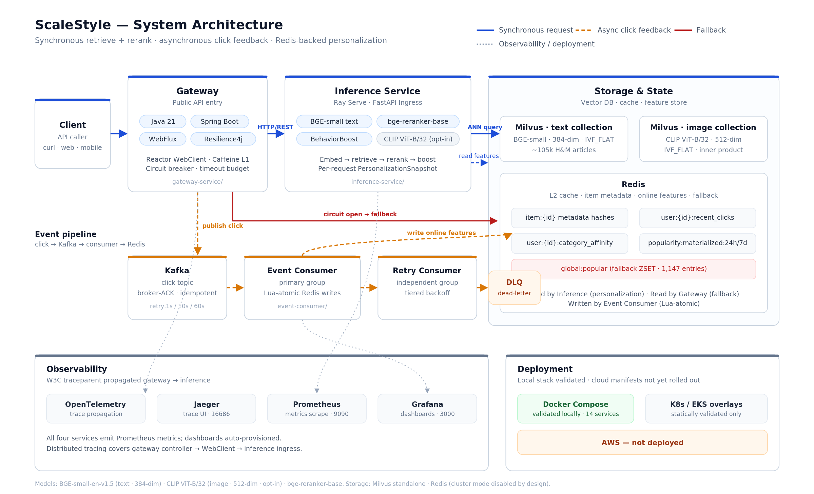
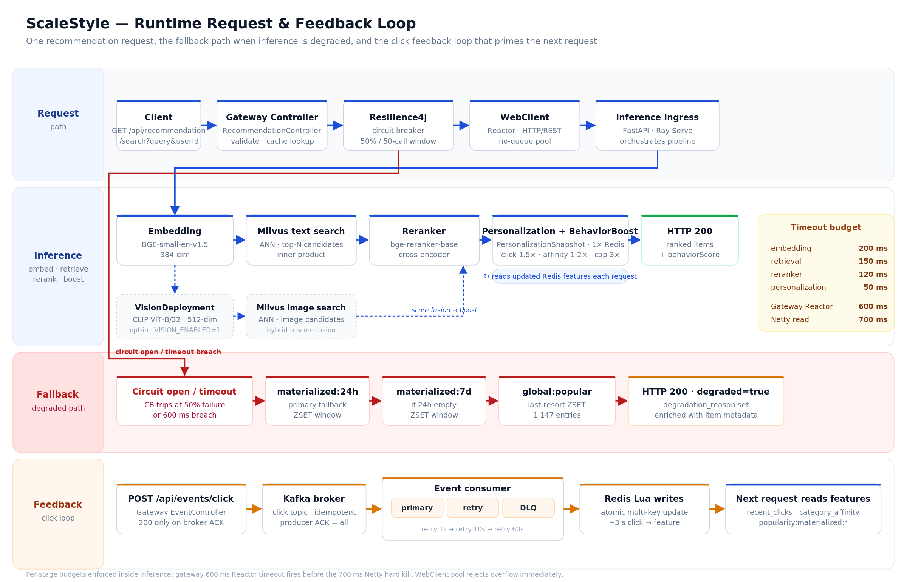

# ScaleStyle

Real-time personalized fashion recommendation system. Accepts natural-language or image queries, retrieves candidates from a vector database, reranks with a cross-encoder, and applies a behavior boost derived from each user's recent click history and rolling popularity signals. Click events flow asynchronously through Kafka into Redis, so the next request immediately reflects the user's most recent behavior.

Fully runnable locally via Docker Compose. Kubernetes manifests (Minikube + EKS overlays) and Terraform for AWS are written; AWS is not deployed.

---

## Features

- **Text search** — natural-language query → BGE-small-en-v1.5 embedding → Milvus ANN retrieval → bge-reranker-base cross-encoder reranking
- **Image search** — CLIP ViT-B/32 image embedding → Milvus ANN retrieval (separate collection); opt-in via `VISION_ENABLED=1`
- **Hybrid search** — fused text + image dual recall with normalized score merge; requires `VISION_ENABLED=1`
- **Real-time personalization** — BehaviorBoost applies click history (1.5×), category affinity (1.2×, time-decayed), and windowed popularity signals per request; max 3× cap
- **Kafka click ingestion** — broker-acknowledged, idempotent producer; HTTP 200 only on confirmed ACK
- **Tiered retry + DLQ** — retry.1s → retry.10s → retry.60s with enforced per-tier delays; primary and retry consumers run independently
- **Three-tier popularity fallback** — materialized 24h → materialized 7d → `global:popular` (1,147 entries)
- **Circuit breaker** — Resilience4j; opens at 50% failure rate over 50-call window; gateway falls back to Redis popularity data
- **Distributed tracing** — W3C `traceparent` propagation from gateway through inference; Jaeger UI
- **Observability** — Prometheus metrics from all four services; Grafana dashboards auto-provisioned

---

## Architecture





### Services

**Gateway** (`gateway-service/`, Java 21, Spring Boot) — public API entry point. Validates requests, manages a two-tier product cache (Caffeine L1 + Redis L2), calls the inference service over HTTP/REST using Reactor WebClient, and publishes click events to Kafka. Resilience4j circuit breaker wraps the inference call; on open circuit, the gateway reads pre-materialized popularity ZSETs from Redis.

**Inference** (`inference-service/`, Python, Ray Serve) — named Ray Serve deployments: `EmbeddingDeployment`, `RetrievalDeployment`, `RerankerDeployment`, `VisionDeployment` (CLIP, opt-in), `PopularityDeployment`, `GenerationDeployment` (disabled by default). `IngressDeployment` is the FastAPI entrypoint; it orchestrates the pipeline and applies BehaviorBoost personalization.

**Event Consumer** (`event-consumer/`, Python, Kafka) — primary and retry consumers run as separate processes with independent consumer group IDs. Each consumed message triggers a Lua script that atomically writes click history, time-decayed category affinity, and windowed popularity buckets to Redis.

**Data Pipeline** (`data-pipeline/`, Python) — one-time ETL. `bootstrap_data.py` loads BGE-small embeddings into Milvus, item metadata into Redis hashes, and seeds the global popularity ZSET from H&M article Parquet files.

### Timeout hierarchy

Inference per-stage budgets (embedding 200ms + retrieval 150ms + reranker 120ms + personalization 50ms ≈ 520ms) fit inside the gateway Reactor timeout (600ms), which fires before the Netty hard socket kill (700ms). The WebClient connection pool never queues — overflow is rejected immediately.

---

## Repository layout

```
ScaleStyle/
├── gateway-service/          # Spring Boot gateway (Java 21)
│   ├── src/main/java/        # Controllers, services, DTOs, config
│   └── src/test/java/        # Unit and service tests
├── inference-service/        # Ray Serve ML inference (Python 3.10)
│   ├── src/deployments/      # ingress, embedding, retrieval, reranker, vision, popularity, generation, router, multimodal
│   ├── src/personalization/  # BehaviorBoost, FeatureReader, PopularityWindows, NullFeatureReader
│   └── tests/                # 60+ unit tests
├── event-consumer/           # Kafka consumer (Python 3.11)
│   ├── src/                  # kafka_loop, retry_router, feature_update_handler, redis_feature_writer, metrics_recorder, trace_context
│   └── tests/                # 189 tests (Lua atomicity, decay, retry, metrics)
├── data-pipeline/            # ETL and bootstrap (Python)
│   ├── src/bootstrap_data.py # Loads Milvus + Redis from Parquet
│   └── tests/
├── infrastructure/
│   ├── k8s/base/             # Kustomize manifests
│   ├── k8s/overlays/minikube/
│   ├── k8s/overlays/eks/     # AWS/EKS overlay + scripts (statically validated, not deployed)
│   └── terraform/            # EKS, ElastiCache, ECR, VPC, IAM
├── observability/            # Prometheus config, Grafana dashboards, alert rules
├── docs/
│   ├── assets/architecture/  # Architecture diagrams (PNG)
│   └── performance/          # Benchmark reports
└── docker-compose.yml        # Full local stack (14 services)
```

---

## Data and model artifacts

### Milvus collections

| Collection | Model | Dimensions | Index |
|---|---|---|---|
| `scale_style_bge_small_v1_5` | BAAI/bge-small-en-v1.5 | 384 | IVF\_FLAT, inner product |
| `scale_style_clip_image_v1` | openai/clip-vit-base-patch32 | 512 | IVF\_FLAT, inner product |

Both collections hold ~105,000 H&M article vectors. The source Parquet files (with pre-computed embeddings) are **not included** in this repository. Obtain the H&M dataset from [Kaggle](https://www.kaggle.com/competitions/h-and-m-personalized-fashion-recommendations/data) and generate embeddings before running bootstrap.

### Models at runtime

| Role | Model | Notes |
|---|---|---|
| Text embedding | `BAAI/bge-small-en-v1.5` | BGE instruction prefix applied at query time |
| Image embedding | `openai/clip-vit-base-patch32` | LRU cache: 256 entries, TTL 600s, per-actor |
| Reranker | `BAAI/bge-reranker-base` | Cross-encoder; `RERANKER_ENABLED=1` by default |
| Generation | `Qwen/Qwen2-1.5B-Instruct` | Disabled by default; requires `GENERATION_ENABLED=1` and 12Gi memory |

---

## Quick start

### Prerequisites

- Docker + Docker Compose
- Python 3.10+
- H&M article Parquet files with BGE-small-en-v1.5 embeddings placed under `data-pipeline/data/processed/`

### 1. Bootstrap data

```bash
cd data-pipeline
pip install -r requirements.txt

# Start storage dependencies
docker compose up -d redis milvus etcd minio

# Load embeddings → Milvus, metadata → Redis
python src/bootstrap_data.py
```

### 2. Start the full stack

```bash
cd ..
docker compose up -d
```

| Service | Port | Notes |
|---|---|---|
| Gateway | 8080 | API entry point |
| Inference | 8000 | Ray Serve; also `/metrics` |
| Event Consumer Primary | 8081 | Prometheus metrics |
| Event Consumer Retry | 8082 | Prometheus metrics |
| Milvus | 19530 | Vector DB |
| Redis | 6379 | Cache and feature store |
| Kafka | 9092 | Event streaming |
| Prometheus | 9090 | Metrics collection |
| Grafana | 3000 | Dashboards — `admin` / `admin` |
| Jaeger | 16686 | Distributed tracing UI |
| MinIO Console | 9001 | Object storage (Milvus backend) |
| Attu | 8088 | Milvus GUI |

Inference takes 30–60s to start (model loading). Wait before sending requests:

```bash
docker compose logs -f inference | grep "Serve application is ready"
```

> Image and hybrid search require `VISION_ENABLED=1`. This is set in `docker-compose.yml` by default for local dev.

---

## API examples

### Text search

```bash
curl "http://localhost:8080/api/recommendation/search?query=slim+fit+jeans&k=5"

# With personalization
curl "http://localhost:8080/api/recommendation/search?query=summer+dress&userId=user123&k=10"
```

Response includes `behaviorScore` when personalization is active:

```json
{
  "status": "success",
  "data": [
    {
      "article_id": "0108775015",
      "product_name": "Slim Fit Jeans",
      "score": 0.82,
      "behaviorScore": 0.3581,
      "rank": 1
    }
  ]
}
```

### Image and hybrid search

```bash
# Image-only
curl -X POST http://localhost:8080/api/recommendation/search/image \
  -H "Content-Type: application/json" \
  -d '{"queryText":"blue jeans","imageBase64":"<base64>","k":10}'

# Hybrid text + image  (note: userId is camelCase in this DTO)
curl -X POST http://localhost:8080/api/recommendation/search/hybrid \
  -H "Content-Type: application/json" \
  -d '{"queryText":"floral dress","imageBase64":"<base64>","k":10,"userId":"user123"}'
```

### Click event ingestion

```bash
# note: user_id and item_id are snake_case in this DTO
curl -X POST http://localhost:8080/api/events/click \
  -H "Content-Type: application/json" \
  -d '{"user_id":"user123","item_id":"0108775015","position":1,"source":"search","device":"web"}'
```

Returns HTTP 200 only after broker ACK. Returns HTTP 503 on timeout or rejection.

### Cache diagnostics

```bash
curl "http://localhost:8080/api/recommendation/debug/cache-stats"
```

---

## Testing

### Run tests

```bash
# Inference service
cd inference-service && pip install -r requirements.in
pytest tests/ -v

# Event consumer
cd event-consumer && pip install -r requirements.txt
pytest tests/ -v --ignore=tests/test_integration.py   # integration requires live Kafka + Redis

# Gateway
cd gateway-service && ./gradlew test

# Data pipeline (skip host-sensitive tests)
cd data-pipeline && pip install -r requirements.txt
pytest tests/ -v \
  --ignore=tests/integration/ \
  --ignore=tests/test_generate_image_embeddings.py \
  --ignore=tests/test_bootstrap_image_collection.py
```

`test_generate_image_embeddings.py` and `test_bootstrap_image_collection.py` SIGSEGV on macOS with numpy 2.x / torchvision — host toolchain issue, not a code defect.

### Test coverage highlights

| Test | Covers |
|---|---|
| `test_behavior_boost_cap.py` | 3× cap prevents multi-signal score domination |
| `test_lua_atomicity.py` | Multi-key Redis writes are atomic via Lua script |
| `test_personalization_contract.py` | Reader/writer canonical ID contract (fakeredis) |
| `test_feature_reader_decay.py` | Exponential affinity decay across time intervals |
| `test_degradation_reasons.py` | Typed DegradationReason enum and NullFeatureReader |
| `test_config_timeouts.py` | All timeout values match documented budgets |
| `test_redis_startup_validation.py` | Service fails fast if Redis is unreachable at startup |
| `EventTrackingServiceBestEffortContractTest.java` | Click tracking degrades gracefully under failure |

---

## Performance summary

> All numbers are from local Docker Compose on an Apple M4 Max (128 GB RAM), CPU-only inference. These are not AWS/EKS numbers.
> Full report: [`docs/performance/final-technical-metrics.md`](docs/performance/final-technical-metrics.md)

### Single-endpoint latency (c=1)

| Endpoint | p50 | p99 | Error rate |
|---|---|---|---|
| Text search | 163.9 ms | 171.0 ms | 0% |
| Image search | 150.4 ms | 164.7 ms | 0% |
| Hybrid search | 151.9 ms | 173.1 ms | 0% |

### Mixed workload (70% text / 15% image / 10% hybrid / 5% click)

| Concurrency | Search RPS | Aggregate p99 | Hard error rate |
|---|---|---|---|
| c=10 | 54.4 | 312.5 ms | 0% |
| c=25 | 58.5 | 610.9 ms | 0% |

### 10-minute soak (c=10, mixed)

39,753 total requests — 0 hard errors — 0 container restarts.

### Notes

**Degraded ≠ failed.** "Degraded" responses are HTTP 200 with fallback items. Text search showed ~13–20% degraded flags in the fixed-query benchmark (10 rotating queries, warm gateway rec-cache, occasional pipeline sum slightly exceeding the 600ms Reactor budget). This is a benchmark artifact; do not read it as a production error rate.

**Image cache.** The LRU cache gives 4–5× throughput improvement in the repeated-image benchmark. Production traffic with unique images still pays cold CLIP encoding (~150–400 ms per request).

---

## Fallback and feedback loop

### Three-tier popularity fallback

When inference is unavailable (circuit open, timeout, or capacity rejection):

1. Gateway reads `popularity:materialized:24h:*` from Redis
2. Falls back to `popularity:materialized:7d:*` if the 24h window is absent
3. Falls back to `global:popular` (1,147 pre-seeded entries) as a last resort

Results are enriched with product metadata from Redis hashes identically to the normal path. The response shape is the same; a `degradation_reason` field indicates the fallback source. Verified live under destructive test (inference container paused).

### Real-time personalization feedback loop

Click event → Kafka → event-consumer → Redis (within ~3s). Next recommendation request reads updated features:

- `user:{id}:recent_clicks` — recent click list (LPUSH + LTRIM, max 100)
- `user:{id}:category_affinity` — time-decayed affinity score per category (half-life 7 days)
- `popularity:materialized:*` — pre-aggregated windowed popularity ZSETs

BehaviorBoost reads all signals once per request into a `PersonalizationSnapshot` (O(1) Redis round-trips) and scores candidates locally. Verified end-to-end: after a single click event, the clicked item appeared in the next hybrid search response with `behaviorScore=0.3581`.

Kafka throughput: 1,000 click events processed at ~970 events/sec with 0 errors.

---

## Kubernetes / AWS deployment status

| Layer | Status |
|---|---|
| K8s base manifests | Complete |
| Minikube overlay — static validation | Passes |
| Minikube overlay — local K8s test | Gateway path partially validated |
| EKS overlay — `kubectl --dry-run=client` | Passes (19 resources, 0 errors) |
| Full K8s E2E | Not performed |
| Terraform — `terraform validate` | Passes |
| AWS resources | **Not provisioned** |

Terraform defines EKS (t3.large, 2–3 nodes), VPC, ElastiCache Redis 7.1 (primary + replica, TLS, automatic failover), ECR repositories, S3, and IAM IRSA roles.

**ElastiCache cluster mode is disabled by design.** The event consumer's Lua script atomically updates keys across `user:*`, `popularity:*`, and `item:*` namespaces. In Redis Cluster, these hash to different slots and produce `CROSSSLOT` errors. The constraint is documented in Terraform and propagated explicitly.

**EFS model cache** — the EKS overlay references an EFS storage class; EFS provisioning is manual and not yet completed.

**RayCluster overlay** (`infrastructure/k8s/overlays/eks/raycluster.yaml`) — optional advanced autoscaling path via KubeRay. The `serveConfigV2` block is marked experimental; the standard inference `Deployment` is the validated path.

To deploy to EKS once AWS is provisioned:

```bash
make tf-init && make tf-plan && make tf-apply
make eks-kubeconfig && make install-alb-controller
make deploy-milvus && make kafka-smoke
make push-ecr-images && make eks-sync-ecr-images
make deploy-production && make verify-deployment
```

---

## Configuration notes

Key environment variables (see `docker-compose.yml` and `infrastructure/k8s/base/` configmap for full list):

| Variable | Default | Notes |
|---|---|---|
| `VISION_ENABLED` | `0` | Set `1` to load CLIP at startup. Required for image and hybrid search. Benchmarks above used `VISION_ENABLED=1`. |
| `GENERATION_ENABLED` | `0` | Set `1` to enable Qwen2-1.5B generation; requires 12Gi memory. |
| `RERANKER_ENABLED` | `1` | Disable to skip cross-encoder and return raw retrieval scores. |
| `VISION_MAX_ONGOING_REQUESTS` | `8` | CLIP actor concurrency limit. 8 chosen after scaling experiment (see performance report §9). |
| `RAY_MEMORY_GB` / `RAY_OBJECT_STORE_GB` | environment-specific | Ray memory budget; see `docker-compose.yml` and K8s overlays for concrete values. |
| `REDIS_TLS` | `false` | Set `true` for ElastiCache. |

---

## Known limitations

- **Local inference is not GPU-accelerated** — no GPU node group is provisioned; the `NUM_GPUS` config surface exists but is unused in the current deployment.
- **Vision opt-in** — `VISION_ENABLED=0` by default. Image and hybrid search are unavailable without setting it to `1` at startup.
- **Generation off by default** — Qwen2-1.5B requires explicit opt-in and significant memory.
- **Milvus standalone** — single-node; adequate for local dev and demos. Production scale requires cluster mode or a managed offering.
- **Single Kafka broker** — local and Strimzi configs use one broker; replication factor 1 for local dev.
- **No authentication** — all API endpoints are open. X-API-Key gateway filter is the planned next step.
- **Data not included** — Parquet files with pre-computed embeddings must be sourced and placed at `data-pipeline/data/processed/` before bootstrap.
- **AWS not deployed** — all performance numbers are local Docker Compose only. EKS/ElastiCache performance has not been measured.
- **No offline evaluation** — no NDCG/recall@k measurement against ground truth is wired.

---

## Future work

- GPU node group for EKS (env vars already in place)
- Offline recall / NDCG evaluation against H&M ground-truth data
- A/B experiment outcome measurement (`ABTestConfig.BASE_FLOW_MODE` config exists; analysis tooling does not)
- Multi-broker Kafka (3-node Strimzi for production durability)
- Distributed image embedding cache (current LRU cache is per Ray actor, not shared across replicas)
- API authentication (X-API-Key gateway filter)
- Feature store abstraction over the informal Redis key schema (`redis_metadata.py` conventions shared across three services)

---

## Where to start

If you are reviewing the implementation, start with:

- [`gateway-service/src/main/java/.../RecommendationService.java`](gateway-service/src/main/java/com/scalestyle/gateway/service/RecommendationService.java) — gateway timeout budget, circuit breaker fallback, metadata enrichment
- [`inference-service/src/deployments/ingress.py`](inference-service/src/deployments/ingress.py) — Ray Serve pipeline orchestration and degradation handling
- [`inference-service/src/personalization/behavior_boost.py`](inference-service/src/personalization/behavior_boost.py) — click, category affinity, and popularity boosting logic
- [`event-consumer/src/feature_update_handler.py`](event-consumer/src/feature_update_handler.py) and [`event-consumer/src/redis_feature_writer.py`](event-consumer/src/redis_feature_writer.py) — Kafka event to Redis feature writes
- [`docs/performance/final-technical-metrics.md`](docs/performance/final-technical-metrics.md) — measured local performance and validation results

---

## License

No license specified.
